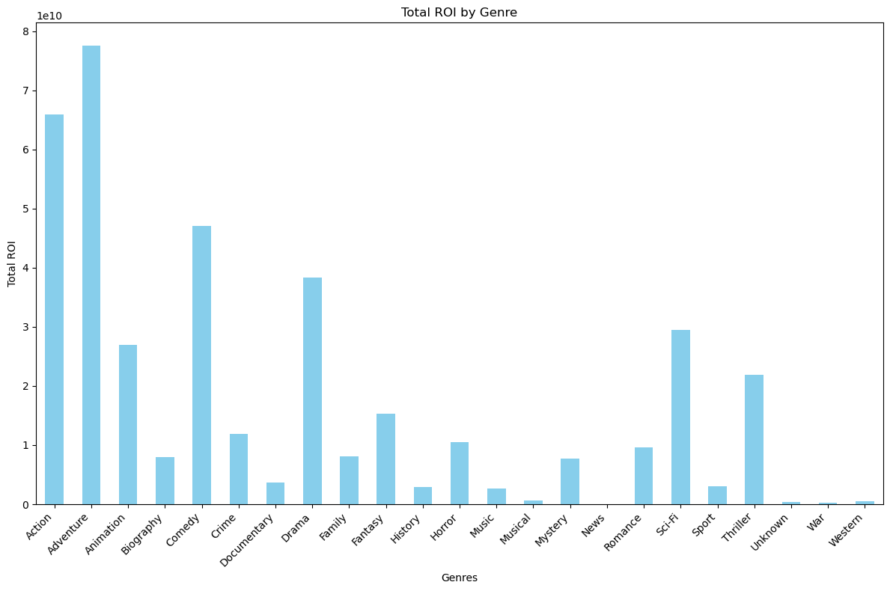
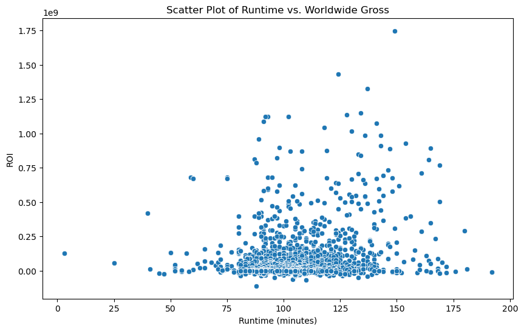
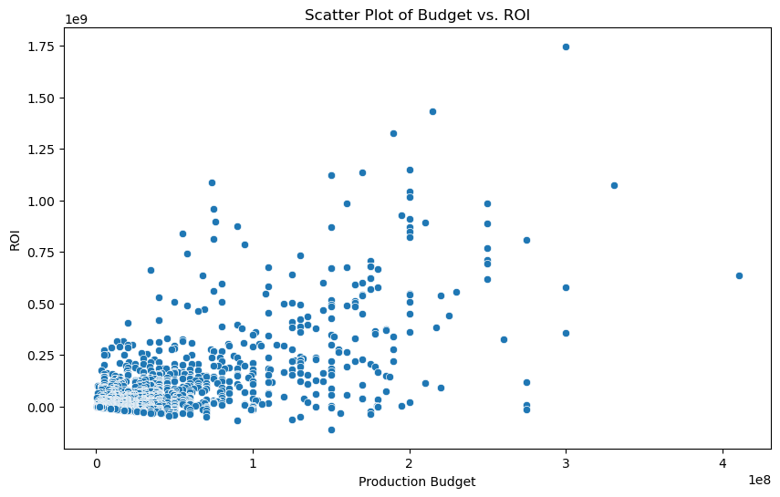
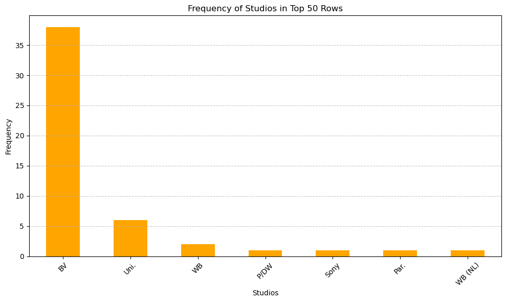

# PHASE 1 PROJECT - MICROSOFT ANALYSIS

**Overview**
Microsoft has seen a gap in the market that involves original content creation and wants to get
into the act. But they do not want to just jump into this blindly.

Which is why this project aims to explore what films are currently doing the best at box office, then translate these findings into actionable insights that the head of Microsoft's new studio can use to help decide what types of films to create.

**Business Understanding**

**Business Questions**
1. The question we're first addressing concerns which genre Microsoft should concentrate on. This entails examining the provided data to discern which genre performs best, guiding Microsoft on which genre can
lead to the highest capital gains.

2. The second question we're addressing is about the ideal movie length. This involves investigation whether there is a correlation between movie length and movie performance.

3. Another question we're exploring is whether having a significant budget is advantageous and if it affects movie performance.

4. Lastly, we want to know who Microsoft's main studio competitors will be once they enter the film industry.

# DATA UNDERSTANDING
In this section we will be reading the recommend datasets to understand what we are working with
and how it can be manipulated, to yield meaningful data for decision making. The specific datasets
that we will be using are:

1. IM.DB
2. Bom.movie.gross.csv
3. Tn.movie_budgets.csv

The first step in data understanding is to import all the necessary python packages eg; pandas.

Then open all the data sets that we are using to know what we will be working with and what 
type of data will be of importance to us. 
Tables in the IM.DB data set were merged.

# DATA PREPARATION
*DATA CLEANING**

Before Data Analysis is done we have to ensure that all the data we are working with is accurate, has no duplicates, or any missing data and ensure each column has the appropriate data type.
The main task involved in data preparation was data cleaning.
Merging of tables was also involved in this stage. Where the important columns from IM.DB, Bom.movie.gross.csv and TN.movie_budgets.csv were all merged into one table called merged_movie_data_cleaned.

# DATA ANALYSIS AND VISUALIZATION
This involved using visualization and analytical techniques to answer our business questions

1. What genre should Microsoft focus on?

Bar graph was plotted with:
x = genres
y = ROI

The visualization indicates that Adventure, Action, Comedy, and Drama genres boast the highest Return on Investment (ROI) among all genres, suggesting their exceptional profitability. Therefore, prioritizing content creation within these genres could significantly enhance Microsoft's financial returns.

2. How long should movies be?

Scatter plot was plotted with:
x = runtime minutes
y = ROI

The data analysis reveals a correlation coefficient of -0.01 between movie duration and performance, as illustrated by the scatter plot. This correlation suggests that there is no apparent relationship between the length of a movie and its overall performance. Consequently, Microsoft has the flexibility to produce movies of varying durations without significant concerns about how it may affect their performance in the market.

3. Is having a huge budget beneficial?

Scatter plot was plotted with:
x = Production budget
y = ROI

Given the correlation coefficient of 0.57 and the scatter plot depicted earlier, it's evident that there exists a moderate correlation between production budget and ROI. This suggests that Microsoft shouldn't hesitate to invest substantially in their movies, as doing so could potentially result in higher quality productions and increased returns on investment.

4. Who is Microsoft's biggest competitor

Bar graph was plotted with
x = Studios
y = Frequency

For this analysis we decided to use the top 50 movies with the highest ROIs and see what studio they
were from. From the visualization above we can see that out of the top 50 movies 38 were from BV studio 
showing that they will be Microsoft's biggest competitor and Microsoft should keep a close watch on them.

# EVALUATION, RECOMMENDATION AND CONCLUSION
Evaluation:

Based on the analysis conducted, several key insights can be drawn regarding Microsoft's potential entry into the film industry:

1. **Genre Focus**: Adventure, Action, Comedy, and Drama genres have shown to yield the highest Return on Investment (ROI). This indicates that Microsoft should consider focusing its efforts on producing content within these genres to maximize profitability.

2. **Movie Duration**: The analysis suggests that there is no discernible correlation between the length of a movie and its performance. Therefore, Microsoft has the flexibility to produce films of varying durations without significant impact on their success.

3. **Production Budget**: A moderate positive correlation exists between production budget and ROI. This implies that allocating a larger budget to film production can potentially lead to higher-quality content and increased financial returns for Microsoft.

4. **Competitive Landscape**: BV Studio emerges as Microsoft's primary competitor, based on the dominance of its movies within the top 50 highest ROI films. It is crucial for Microsoft to closely monitor BV's strategies and performance in the market.

Recommendations:

1. **Strategic Genre Focus**: Microsoft should prioritize the production of movies within the Adventure, Action, Comedy, and Drama genres to capitalize on their proven success in generating high ROI. 

2. **Flexible Budget Allocation**: While investing significantly in production budgets can lead to better-quality films and increased profitability, Microsoft should also maintain flexibility in budget allocation to adapt to different project requirements and market dynamics. 

3. **Continuous Monitoring of Competitors**: Keeping a close watch on BV Studio's activities, releases, and performance metrics will enable Microsoft to identify emerging trends, anticipate market shifts, and adjust its strategies accordingly.

4. **Freedom in film making**: Microsoft should not worry about how long or short the movies might be when 
creating the movies. Primary focus should be on quality and not movie length.

By implementing these recommendations and leveraging the insights gained from the analysis, Microsoft can strategically position itself for success in the competitive film industry landscape.

Conclusion:

In conclusion, the analysis provides valuable insights for Microsoft as it considers entering the film industry. By focusing on genres with proven high ROI, maintaining flexibility in budget allocation, and closely monitoring competitors, Microsoft can enhance its chances of success in the market. Additionally, the absence of a significant correlation between movie duration and performance affords Microsoft the freedom to experiment with different film lengths without compromising on success. 
